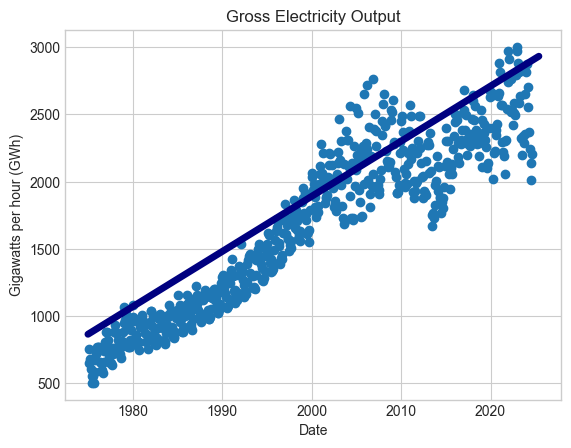
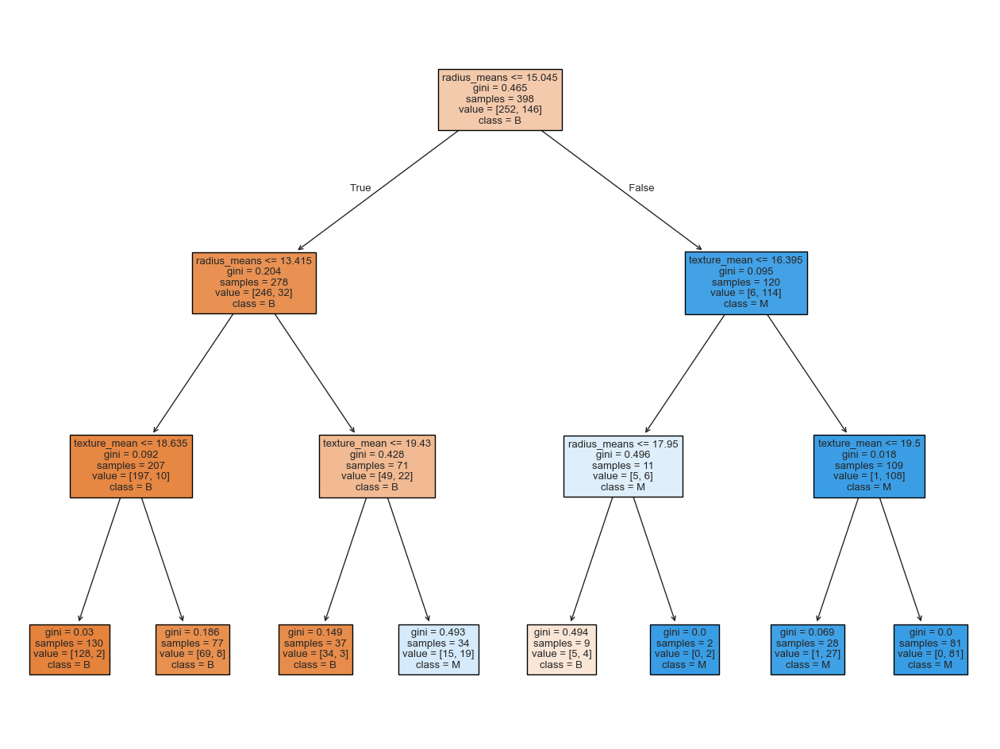
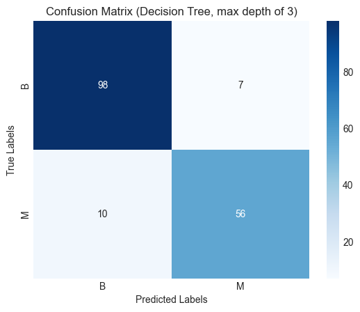

# Data Science Portfolio

**Name:** Ivan Yankovski

**Student ID:** C00259561

**Course:** BSc (Hons) in Software Development at South East Technological University

**Portfolio Website:** datascienceportfol.io/ivankoski33

# Projects

## Analysis of Electricity Output in Ireland

A linear regression analysis of the electricity output through the national grid in Ireland.

### Data Source

**This data was sourced from the Central Statistics Office's open data platform - https://data.cso.ie/table/MSM01**

This dataset contained extraneous data due to the fact it contains Gross Electricity Output and Net Electricity Output. Within the notebook, its further explained in the netbook how I dealt and processed the data.

### Visualisation

## Using Decision Trees & Random Forests to predict whether a cancerous tumor is malignant or benign

A predictive analysis of determing whether a cancerous tumor is malignant or benign, using decision tree and random forest classifiers.

### Data Source

**This data was sourced from Kaggle - https://www.kaggle.com/datasets/uciml/breast-cancer-wisconsin-data**

### Visualisation

**Using scikit-learn, I generated multiple visualisations for the analysis in the notebook. Below is one of them with the following parameters.**

*DecisionTreeClassifier(max_depth=3, random_state=33)*

